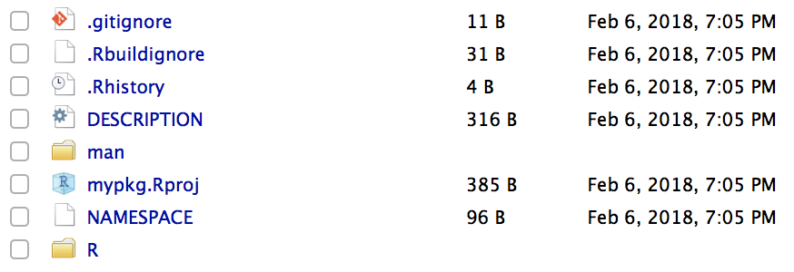

## What is "usethis"?

 - The `usethis` package has been designed to assist with package development: 

    https://www.tidyverse.org/articles/2017/11/usethis-1.0.0/

        "usethis is designed to smooth package-development workflows by 
        automating everything that can be automated. Many of the functions 
        were previously part of devtools, but have been extracted out in 
        their own package to give them more room to grow."

 - Much of the functionality we just used from `devtools` is currently being migrated to `usethis`.
 
 - It is now on CRAN, so can be installed via:

```{r eval=FALSE}
install.packages("usethis")
```

## Package creation

 - The `create_package()` function initialises a package skeleton as an R project, 
 ready for version control with Git.

```{r eval=FALSE}
library(usethis)

# Create a new package -------------------------------------------------
create_package("mypkg")
```

<center></center>

<BR>
https://www.tidyverse.org/articles/2017/11/usethis-1.0.0/

## Defining dependencies

 - To declare that your project has some dependencies, use use_package():

```{r eval=FALSE}
use_package("ggplot2")
#> ✔ Adding 'ggplot2' to Imports field in DESCRIPTION
#> ● Refer to functions with `ggplot2::fun()`

use_package("dplyr")
#> ✔ Adding 'dplyr' to Imports field in DESCRIPTION
#> ● Refer to functions with `dplyr::fun()`
```

<BR><BR><BR><BR><BR>
https://www.tidyverse.org/articles/2017/11/usethis-1.0.0/

## Documentation

 - `use_roxygen_md()` sets up roxygen2 & enables markdown mode: use markdown in your roxygen2 comments.

 - `use_package_doc()` creates a skeleton documentation file for the complete package, taking the advantage of the latest `roxygen2` features to minimise duplication between the `DESCRIPTION` and the documentation.

 - `use_readme_rmd()` creates a `README.Rmd`: use this to describe what your package does.

 - `use_news_md()` creates a basic `NEWS.md` to record changes.

 - `use_vignette("vignette-name")` configures `DESCRIPTION` and creates a `.Rmd` template in `vignettes/`.

https://www.tidyverse.org/articles/2017/11/usethis-1.0.0/

## Software licenses

  - `use_mit_license()`
  - `use_apl2_license()`
  - `use_gpl3_license()`
  - `use_cc0_license()`
  
```{r eval=FALSE}
use_mit_license("Mik Black")

#> ✔ Setting License field in DESCRIPTION to 'MIT + file LICENSE'
#> ✔ Writing 'LICENSE.md'
#> ✔ Adding '^LICENSE\\.md$' to '.Rbuildignore'
#> ✔ Writing 'LICENSE'
```

<BR><BR><BR>
https://www.tidyverse.org/articles/2017/11/usethis-1.0.0/

## Git and GitHub

 - Activate git:

```{r eval=FALSE}
use_git()

#> ✔ Initialising Git repo
#> ✔ Adding '.Rhistory', '.RData', '.Rproj.user' to './.gitignore'
#> ✔ Adding files and committing
```

 - Publish to GitHub:

```{r eval=FALSE}
use_github()
```

 - Awesome guide to help you work with Git and GutHub in RStudio: http://happygitwithr.com/

<BR>
https://www.tidyverse.org/articles/2017/11/usethis-1.0.0/
